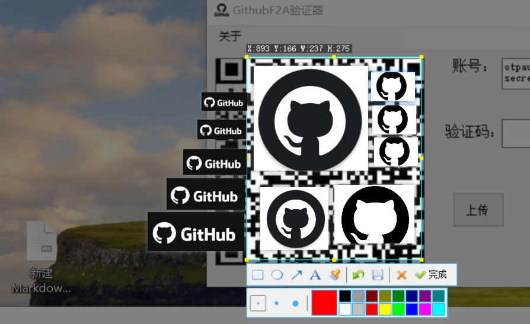
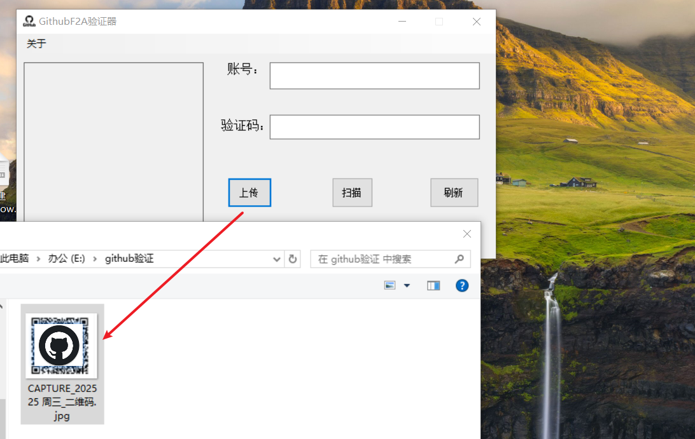
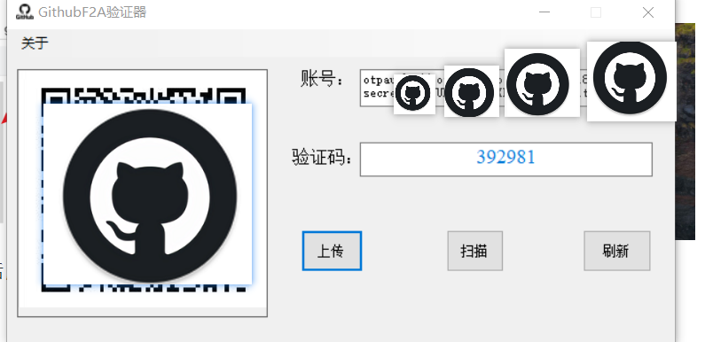

# GitHubF2A

## Introduction

`GithubF2A` is a software designed to assist with GitHub's two-factor authentication (2FA) process. It aims to help users complete GitHub's 2FA more conveniently by scanning the QR code provided by the GitHub website or analyzing a locally stored QR code. Users can quickly generate and refresh verification codes, enhancing the security of their login process.

## Features

- **Scan QR Code**: Users can click the "Scan" button to directly capture the QR code provided by GitHub's official website. The software will automatically recognize and analyze it.
- **Upload Local QR Code**: Click the "Upload" button to select a locally stored QR code image. The software will analyze and extract relevant information.
- **Refresh Verification Code**: Click the "Refresh" button to generate a new verification code in real-time, ensuring that the latest verification information is used for each login.

## Usage

1. **Install the Software**:
   - Download the latest version of the `GithubF2A` installation package from [GitHub Releases](https:#).
   - This software supports 64-bit Windows 10 systems.

2. **Configure GitHub Two-Factor Authentication**:
   - Log in to your GitHub account and go to the [Two-Factor Authentication settings page](https://github.com/settings/two_factor_authentication).
   - Enable two-factor authentication and select "Use an authentication app."
   - GitHub will generate a QR code for association with the authentication app.

3. **Use `GithubF2A`**:
   - Open the `GithubF2A` software.
   - Click the "Scan" button. After capturing the QR code, the software will automatically analyze the QR code from GitHub's website and generate the verification code.
      
    - Alternatively, click the "Upload" button to select a locally saved QR code image.
      
       The software will analyze and extract the relevant information from the image.
      
   - Click the "Refresh" button to generate a new verification code.
## Notes

- **Security**: Ensure you are using `GithubF2A` in a secure network environment to prevent the leakage of QR code information.
- **QR Code Format**: Only standard QR code formats are supported. Other types of barcodes or custom formats are not supported.
- **Software Updates**: Regularly check for software updates to get the latest features and security fixes.

- **v1.0.0**: Initial release, supporting basic QR code scanning, uploading, and verification code refresh features.

I hope this `README.md` file will help GitHub users better understand and utilize GitHub's two-factor authentication with the assistance of `GithubF2A`. My goal is to make the process as convenient as possible for everyone. If you have any suggestions for improvement or encounter any issues, please feel free to let us know. Your feedback is highly appreciated!

# GithubF2A

## 简介

`GithubF2A` 是一款协助 GitHub 二步验证的软件，旨在帮助用户更便捷地完成 GitHub 的二步验证流程。通过扫描 GitHub 官网提供的二维码或分析本地存储的二维码，用户可以快速生成并刷新验证码，提升登录安全性。

## 功能特点

- **扫描二维码**：用户点击“扫描”按钮，可直接截图 GitHub 官网给出的二维码，软件将自动识别并解析。
- **上传本地二维码**：点击“上传”按钮，可选择本地存储的二维码图片，软件将分析并提取相关信息。
- **刷新验证码**：点击“刷新”按钮，可实时生成新的验证码，确保每次登录时都能使用最新的验证信息。

## 使用方法

1. **安装软件**：

   - 从 [GitHub Releases](https://kimi.moonshot.cn/chat/cuhlbermv21lf1vqnlig#) 下载最新版本的 `GithubF2A` 安装包。
   - 支持Win10 64位系统。

2. **配置 GitHub 二步验证**：

   - 登录 GitHub 账号，进入 [二步验证设置页面](https://github.com/settings/two_factor_authentication)。
   - 启用二步验证，选择“使用身份验证应用”。
   - GitHub 会生成一个二维码，用于与身份验证应用关联。

3. **使用 `GithubF2A`**：

   - 打开 `GithubF2A` 软件。

   - 点击“扫描”按钮，将二维码截图完成后软件将自动解析 GitHub 官网的二维码，并生成验证码。

     

   - 或者点击“上传”按钮，选择本地保存的二维码图片。

     

   - 软件解析成功后，会显示当前的验证码。

     

   - 点击“刷新”按钮，可获取新的验证码。

## 注意事项

- **安全性**：请确保在安全的网络环境下使用 `GithubF2A`，避免二维码信息泄露。
- **二维码格式**：仅支持标准的二维码格式，不支持其他类型的条形码或自定义格式。
- **软件更新**：建议定期检查软件更新，以获取最新的功能和安全修复。

## 

- **v1.0.0**：首次发布，支持基本的二维码扫描、上传和验证码刷新功能。

  

希望这个 `README.md` 文件能够帮助Github用户更好地了解和使用Github的二步验证， `GithubF2A`。希望能够给大家带来方便，如果有任何需要调整的地方，请随时告诉我。
